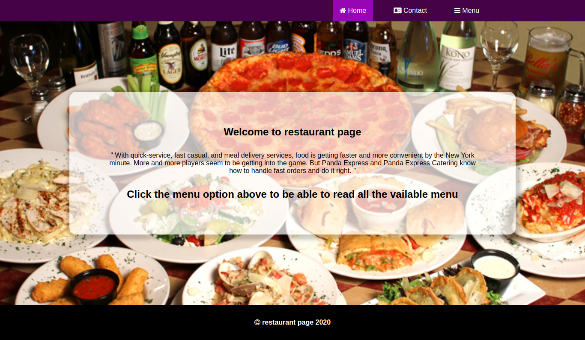

# Restaurant page

## Project description
This project is a restaurant web application which is used with a restaurant to showcase their food and services they offer.

This project was done for learning purpose, the main goal of this project is for for showing the understanding of the benefits of modularized code as well as the ability to set up a javascript application made of different modules using webpack. Project's specifications are listed on [theodinproject](https://www.theodinproject.com/courses/javascript/lessons/restaurant-page)

## Screenshot

## Built with
- HTML5
- CSS3
- Vanilla Javascript
- Webpack 4

## Deployment
[restaurant-page app on netlify](https://restaurant-page-app.netlify.app/)

## Running and testing it locally

### Prerequisites
- You need to have nodejs already installed with npm

### Setup
- Run `git clone https://github.com/descholar-ceo/restaurant-page && cd restaurant-page` to get a copy of source codes on your local computer and to navigate inside the project directory
- Run `npm install`
- Create a file in root directory of the cloned repository call it `.env`, add PORT=[number of your choice] `eg: PORT=8080` as I showcased that on `.env.example` file

### Usage
- Run `npm run dev` or `yarn dev` or `npm start` or yarn start
=> Normally your default web browser should be opened automatically and shows you the restaurant page opened, if it didn't, then go to your browser and navigate to `http://localhost:[PORT YOU SPECIFIED IN .env file]`

### Tests
- No test yet

## Contributions

There are two ways of contributing to this project:

1.  If you see something wrong or not working, please check [the issue tracker section](https://github.com/descholar-ceo/restaurant-page/issues ), if that problem you met is not in already opened issues then open a new issue by clicking on `new issue` button.

2.  If you have a solution to that, and you are willing to work on it, follow the below steps to contribute:
    1.  Fork this repository
    1.  Clone it on your local computer by running `git clone https://github.com/your-username/restaurant-page.git` __Replace *your username* with the username you use on github__
    1.  Open the cloned repository which appears as a folder on your local computer with your favorite code editor
    1.  Create a separate branch off the *master branch*,
    1.  Write your codes which fix the issue you found
    1.  Commit and push the branch you created
    1.  Raise a pull request, comparing your new created branch with our original master branch [here](https://github.com/descholar-ceo/restaurant-page)

## Author

👤 **Mugirase Emmanuel**

- Github: [@descholar-ceo](https://github.com/descholar-ceo)
- Twitter: [@descholar3](https://twitter.com/descholar3)
- Linkedin: [MUGIRASE Emmanuel](https://www.linkedin.com/in/mugirase-emmanuel)

## Show your support

Give a ⭐️ if you like this project!

## Acknowledgment
* [Microverse](https://www.microvese.org)